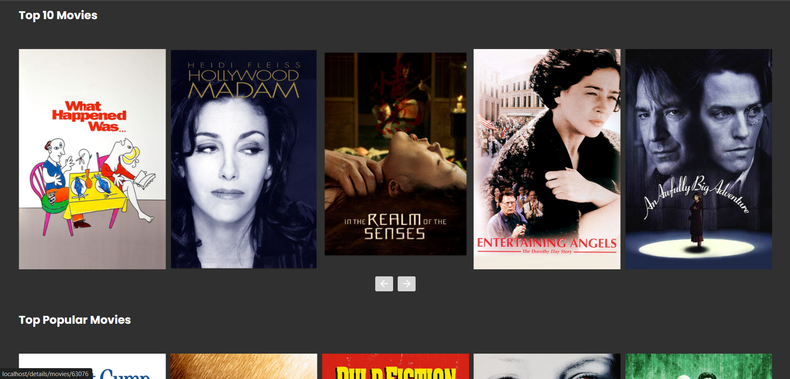
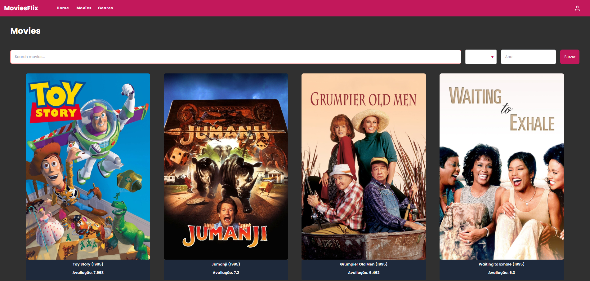
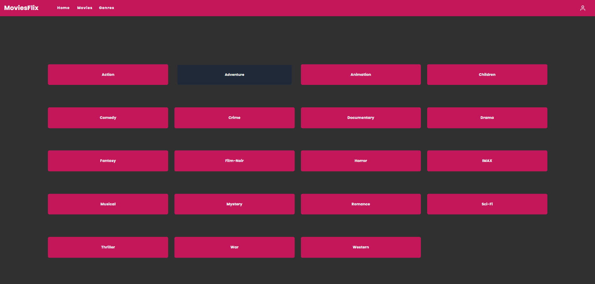

# Projeto MovieFlix

Este projeto consiste em uma aplicação web para gerenciamento de filmes, utilizando tecnologias modernas para frontend e backend, com integração a bancos de dados e serviços externos.

## Tecnologias Utilizadas

### Backend

- **Node.js**: Ambiente de execução JavaScript no servidor.
- **Express**: Framework minimalista para criação de APIs.
- **Prisma ORM**: Gerenciador de banco de dados para interação com MySQL.
- **MySQL**: Banco de dados relacional para armazenar informações dos filmes.
- **CSV-Parser**: Biblioteca para extração de dados de arquivos `.csv`.
- **Docker**: Para conteinerização do backend.

### Frontend

- **Angular 15**: Framework para desenvolvimento da interface do usuário.
- **Axios**: Cliente HTTP para comunicação com a API.
- **API do TheMovieDB**: Utilizada para obter informações detalhadas sobre filmes.
- **Dados do MovieLens**: Base de dados para análise e recomendação de filmes.
- **Angular Material**: Biblioteca de componentes para construção da interface.
- **TailwindCSS**: Utilizado para estilização dos componentes.
- **Docker**: Para conteinerização do frontend.

## Instalação e Execução

### Requisitos

- Docker e Docker Compose instalados.
- Node.js e Yarn instalados (caso não utilize Docker).

## Instalação e Execução

### Requisitos

- Docker e Docker Compose instalados.

### Executando a Aplicação

1. Clone o repositório:
   ```sh
   git clone https://github.com/MaikonLima/movieflix.git
   cd movieflix
   ```
2. Execute o comando abaixo para iniciar os containers do backend, frontend e banco de dados:
   ```sh
   docker-compose up --build
   ```

A aplicação estará disponível em `http://localhost` (Frontend) e a API em `http://localhost:3000`.

## Funcionalidades

[x] - Importação de arquivos CSV contendo informações de filmes.
[x] - Busca de informações de filmes na API do TheMovieDB.
[x] - Exibição de lista de filmes com filtros e ordenação.
[x] - Sistema de recomendação baseado nos dados do MovieLens.
[x] - Interface responsiva e moderna com Angular Material e TailwindCSS.
[x] - Buscar filmes por título → Retorna todos os filmes que correspondem a um título específico ou parte dele.
[x] - Buscar filmes por ano e gênero → Retorna os filmes lançados em um determinado ano e que pertencem a um gênero específico.
[x] - Listar os K filmes mais bem avaliados → Retorna os melhores filmes ordenados por nota média de avaliação.

## Melhorias:

[ ] - Login/Autenticação → Implementação de autenticação do usuário.
[ ] - Criação do Modulo de Usuário.
[ ] - Autenticação das Rotas.(Front)
[ ] - Feature de assistir trailer de um determinado filme.(Front)
[ ] - Feature de favoritar filmes.
[ ] - Deploy em algum serviço de nuvem.(Back)

## Capturas de Tela

### Tela Inicial







## Contribuição

Contribuições são bem-vindas! Fique à vontade para abrir issues e enviar pull requests.
